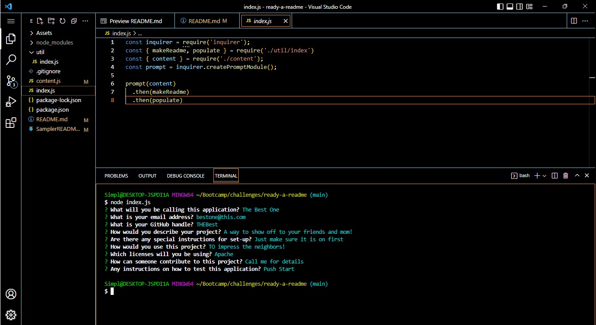

# Ready-a-README
  
  ## Table of Contents
  - [Description](#description)
  - [Tests](#tests)
  - [Image](#image)
  - [Test Video](#testvideo)
  - [Questions](#questions)
  
  ## Description
  The Ready-a-README is a handy README builder created to speed your projects completion up. You won't need to refer to any documentaion on markdown, it is built in for you. This is all done within the node.js and can be reused as often as needed.
  
  ## Tests
  To use and test the capabilities of Ready-a-README, navigate to the containing folder in the terminal and run node index.js. Fill out the necisary information and you are good to go!
  
  ## Image

  

  ## Test Video

  [In Action](https://app.castify.com/view/e67a602c-9173-41de-a9a9-6dd69fcd400f)
  
  ## Questions
  If you need any more information on using this application, my email is simplererstone@gmail.com.
  My GitHub profile can be located here - >  [Simplerer](https://github.com/Simplerer)  < -
  The repo can specifically be found here - >  [https://github.com/Simplerer/ready-a-readme]  < -